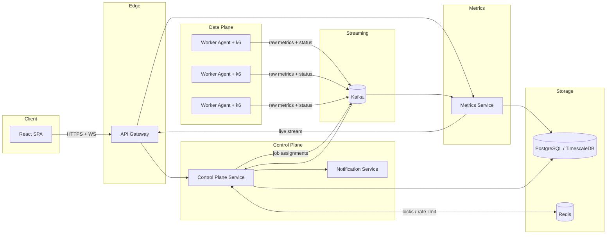

# LoadForge — Distributed Load Testing Platform

> A production-grade, horizontally-scalable load testing platform that orchestrates
> fleets of **k6** workers to generate distributed load, streams metrics through
> **Kafka**, aggregates them into **PostgreSQL/TimescaleDB**, and visualizes results
> in real time via **React** dashboards and **Grafana**.

LoadForge lets teams define HTTP load tests, execute them across an elastic pool of
worker agents, and observe latency, throughput, and error-rate metrics live — the way
SaaS platforms like k6 Cloud, BlazeMeter, and Grafana Cloud k6 operate internally.

---

## Why this project

This repository is engineered to demonstrate **senior/staff-level system design**:

- **Event-driven microservices** with clear bounded contexts (DDD).
- **Distributed orchestration** — sharding virtual users (VUs) across N workers.
- **High-throughput streaming pipeline** — Kafka ingest → windowed aggregation → time-series store.
- **Real-time UX** — WebSocket/SSE live metrics with sub-second refresh.
- **Cloud-native operations** — Docker, Kubernetes, Helm, Prometheus, Grafana, OpenTelemetry.
- **Production concerns** — multi-tenancy, RBAC, idempotency, backpressure, DLQs, autoscaling.

---

## Tech stack

| Layer | Technology |
|---|---|
| Backend runtime | Java 21 (virtual threads), Spring Boot 3.3 |
| Build | Gradle (Kotlin DSL), multi-module monorepo |
| Messaging | Apache Kafka (Redpanda-compatible for local dev) |
| Data store | PostgreSQL 16 + TimescaleDB extension (time-series) |
| Cache / coordination | Redis (rate limiting, distributed locks, live fan-out) |
| Load engine | k6 (executed by worker agents) |
| Frontend | React 18, TypeScript, Vite, TanStack Query, Recharts |
| API edge | Spring Cloud Gateway |
| AuthN/AuthZ | Keycloak (OIDC), JWT resource servers, project-scoped RBAC |
| Observability | Prometheus, Grafana, OpenTelemetry, Loki (logs) |
| Packaging | Docker, Kubernetes, Helm, Kustomize |
| CI/CD | GitHub Actions |

---

## Architecture at a glance



---

## Documentation index

The full, implementation-ready architecture lives in [`docs/architecture`](docs/architecture):

| # | Document | Contents |
|---|---|---|
| 01 | [System Architecture](docs/architecture/01-system-architecture.md) | C4 context/container/component views, cross-cutting concerns, tech decisions |
| 02 | [Service Boundaries](docs/architecture/02-service-boundaries.md) | Bounded contexts, responsibilities, ownership, sync/async contracts |
| 03 | [Monorepo Structure](docs/architecture/03-monorepo-structure.md) | Full folder tree, Gradle modules, conventions |
| 04 | [Database Schema](docs/architecture/04-database-schema.md) | ERD + full PostgreSQL/TimescaleDB DDL, indexing, partitioning |
| 05 | [Kafka Topics](docs/architecture/05-kafka-topics.md) | Topic catalog, keys, partitions, retention, event schemas, DLQ strategy |
| 06 | [REST API Specification](docs/architecture/06-rest-api.md) | Endpoint catalog, payloads, status codes, OpenAPI snippet, streaming APIs |
| 07 | [Domain Models](docs/architecture/07-domain-models.md) | Java 21 aggregates, value objects, enums, event contracts |
| 08 | [UML & Sequence Diagrams](docs/architecture/08-diagrams.md) | Class diagrams, state machines, sequence flows |
| 09 | [Development Roadmap](docs/architecture/09-roadmap.md) | Phased milestones, exit criteria, resume talking points |

---

## Quick start (target developer experience)

```bash
# 1. Boot local infra (Kafka, Postgres/TimescaleDB, Redis, Keycloak, Prometheus, Grafana)
make infra-up

# 2. Run the backend services
./gradlew :services:control-plane:bootRun
./gradlew :services:metrics-service:bootRun
./gradlew :services:worker-agent:bootRun

# 3. Run the frontend
cd frontend/web-app && pnpm install && pnpm dev

# 4. Open the app
open http://localhost:5173
```

> See [`docs/architecture/03-monorepo-structure.md`](docs/architecture/03-monorepo-structure.md)
> for the complete developer workflow.

---

## Design assumptions

These are deliberate architectural decisions (documented so reviewers understand the trade-offs):

1. **TimescaleDB over a separate TSDB.** Satisfies the "PostgreSQL" requirement while
   giving hypertables, continuous aggregates, and retention policies suited to metric volume.
2. **Keycloak over hand-rolled auth.** Real platforms delegate identity; services are pure OIDC resource servers.
3. **Kafka pull-model for workers.** Workers consume from partitioned job topics (consumer groups)
   rather than being individually addressed — this is what makes the data plane elastically scalable.
4. **Worker agent wraps k6.** The agent parses k6's streaming output, enriches samples with
   `runId/workerId/shard`, and republishes to Kafka, keeping k6 as a swappable engine.
5. **CQRS-lite in the metrics path.** Writes go through the streaming aggregation pipeline;
   reads are served from pre-aggregated hypertables and continuous aggregates.
