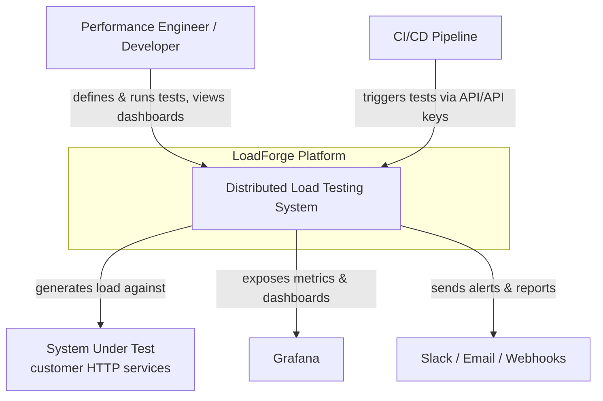
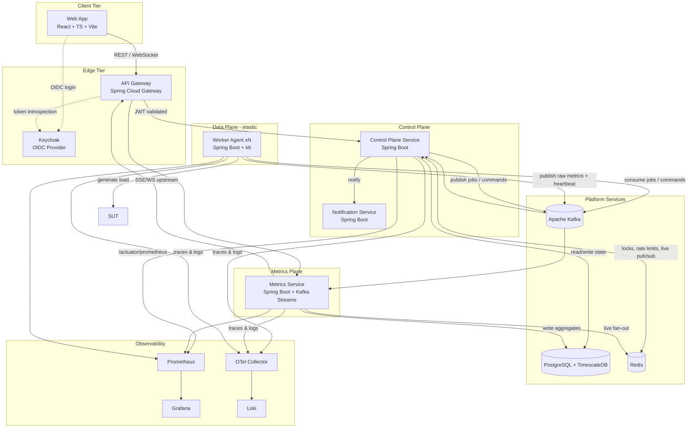
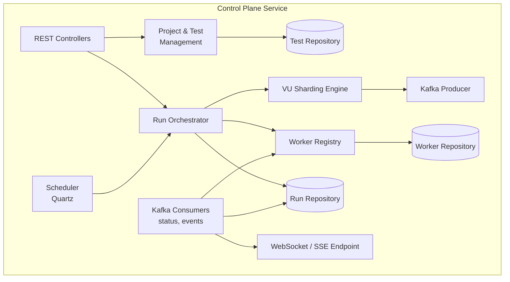
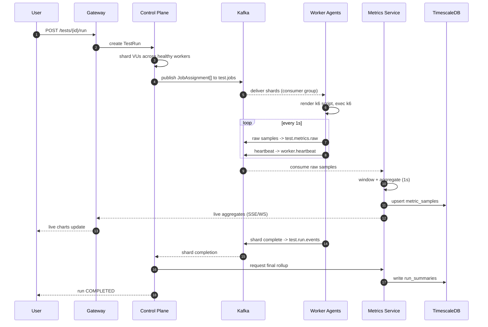

# 01 — System Architecture

## 1. Purpose & scope

LoadForge is a distributed system that turns a **test definition** (target, request shape,
load profile, thresholds) into **distributed load** executed across many worker nodes, then
collects and aggregates the resulting metrics for real-time and historical analysis.

The system is decomposed into a **Control Plane** (stateful orchestration & management) and a
**Data Plane** (stateless, elastic load generation), connected by **Kafka** as the async spine.

---

## 2. C4 — Level 1: System Context

**Actors**

- **Performance Engineer / Developer** — authors test definitions, launches runs, inspects results.
- **CI/CD pipeline** — triggers tests as quality gates using scoped API keys.
- **System Under Test (SUT)** — external HTTP endpoints the platform loads.

**External systems** — Grafana (dashboards), notification channels (Slack/email/webhooks), Keycloak (identity).

---

## 3. C4 — Level 2: Container view

### Container responsibilities

| Container | Type | Responsibility |
|---|---|---|
| **Web App** | SPA | Test authoring, run control, live/historical dashboards, admin. |
| **API Gateway** | Edge | TLS termination, routing, JWT validation, rate limiting, WS upgrade, request correlation. |
| **Keycloak** | Identity | OIDC login, token issuance, realm/roles. |
| **Control Plane Service** | Stateful core | Test/project management, run lifecycle, VU sharding, worker registry, scheduling. |
| **Metrics Service** | Stream processor | Consume raw samples, window & aggregate, persist, live fan-out, compute run summaries. |
| **Worker Agent** | Data plane | Register/heartbeat, pull job shard, render k6 script, run k6, stream metrics. |
| **Notification Service** | Async worker | Consume run events, deliver Slack/email/webhook, manage channels. |
| **Kafka** | Backbone | Durable async transport, decoupling, backpressure, replay. |
| **PostgreSQL/TimescaleDB** | Store | Relational domain + time-series hypertables + continuous aggregates. |
| **Redis** | Support | Rate-limit counters, distributed locks, ephemeral live-metrics pub/sub. |

---

## 4. C4 — Level 3: Control Plane components

Key internal collaborations:

- **Run Orchestrator** owns the `TestRun` aggregate lifecycle (state machine in doc 08).
- **VU Sharding Engine** partitions requested VUs/arrival-rate across healthy workers and emits `JobAssignment` events.
- **Worker Registry** tracks worker health from heartbeats; feeds capacity to the sharder.
- **Scheduler** (Quartz + Postgres job store) triggers cron-based runs.

---

## 5. Runtime flow (happy path, condensed)

---

## 6. Cross-cutting concerns

### 6.1 Scalability
- **Data plane** scales horizontally: add worker replicas → more Kafka consumers in the job group → more VU capacity. HPA on CPU + custom "pending VUs" metric.
- **Metrics service** scales by Kafka partition count on `test.metrics.raw` (partition = parallelism ceiling).
- **Control plane** scales read paths; run orchestration is guarded by Redis distributed locks per `runId` to keep a single writer.

### 6.2 Reliability & fault tolerance
- **Idempotency** — job assignments and metric writes carry idempotency keys (`runId:shard:seq`); Kafka consumers are effectively-once via upserts.
- **Backpressure** — Kafka absorbs bursts; workers throttle publish if lag high.
- **Dead Letter Queues** — every consumer has a `<topic>.dlq` with a retry topic + exponential backoff.
- **Worker failure** — missed heartbeats (> 15s) mark a shard `LOST`; orchestrator can re-shard remaining VUs or fail the run per policy.
- **Graceful shutdown** — workers drain in-flight iterations and emit a final flush before exit.

### 6.3 Consistency
- Relational domain state = **strong consistency** (Postgres transactions).
- Metrics = **eventual consistency** with bounded lag (target < 2s end-to-end).
- Run state transitions are serialized per run via optimistic locking (`@Version`) + Redis lock.

### 6.4 Security
- OIDC (Keycloak) → JWT resource servers. Gateway validates signature/exp; services enforce scopes.
- **Project-scoped RBAC**: `OWNER > ADMIN > EDITOR > VIEWER`.
- **API keys** (hashed, prefixed, scoped) for CI triggers.
- mTLS between services in-cluster (Istio/Linkerd optional); secrets via k8s Secrets / Vault.
- SSRF guardrails on target URLs (deny internal CIDRs unless allow-listed per org).

### 6.5 Observability
- **Metrics** — Micrometer → Prometheus; RED metrics per service + domain metrics (active runs, worker utilization, Kafka lag).
- **Tracing** — OpenTelemetry auto-instrumentation; trace propagated from gateway → services → Kafka headers.
- **Logging** — structured JSON logs with `traceId`, `runId`, `workerId`; shipped to Loki.
- **Dashboards** — Grafana: platform health + per-run test dashboards.

### 6.6 Multi-tenancy
- Tenancy = **Organization**. All domain rows carry `org_id`; queries are org-filtered at the repository layer (row-level scoping) and enforced by policy in the service layer.

---

## 7. Key architectural decisions (ADR summary)

| ADR | Decision | Rationale | Trade-off |
|---|---|---|---|
| 001 | Split Control Plane / Data Plane | Independent scaling & failure isolation | More moving parts |
| 002 | Kafka as the async spine | Decoupling, replay, backpressure, fan-out | Operational complexity |
| 003 | TimescaleDB for metrics | One DB engine, hypertables + continuous aggregates | Not a purpose-built TSDB |
| 004 | Worker agent wraps k6 | k6 is best-in-class; keep engine swappable | Extra process management |
| 005 | Keycloak for identity | Don't build auth; standard OIDC | Extra infra dependency |
| 006 | Gradle multi-module monorepo | Shared contracts, atomic changes | Larger build graph |
| 007 | WebSocket/SSE for live metrics | Sub-second UX without polling | Sticky sessions at edge |

> Full ADRs live in `docs/adr/` (one file per decision) in the implementation phase.
