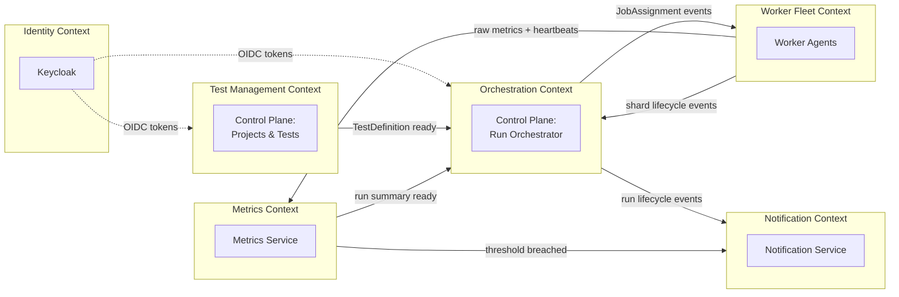

# 02 — Service Boundaries

LoadForge is decomposed using **Domain-Driven Design**. Each service owns a bounded context,
its own schema (schema-per-service inside one Postgres cluster for this project), and a clear
contract. Services never share tables; they integrate via **synchronous REST** (queries/commands
that need an immediate answer) or **asynchronous Kafka events** (facts that already happened).

---

## 1. Context map



> **Note:** *Test Management* and *Run Orchestration* are two bounded contexts that ship inside a
> single deployable (**Control Plane Service**) to reduce operational overhead for this project,
> while keeping code modularized so they can be split later (modular monolith → microservices path).

---

## 2. Services

### 2.1 API Gateway
| Aspect | Detail |
|---|---|
| **Responsibility** | Single entry point: routing, TLS, JWT validation, rate limiting, CORS, WS/SSE upgrade, request correlation IDs. |
| **Owns** | No domain data. Route config, rate-limit policies (Redis). |
| **Tech** | Spring Cloud Gateway (reactive). |
| **In** | HTTPS/WSS from SPA & CI. |
| **Out** | REST to Control Plane & Metrics Service. |
| **Scaling** | Stateless, horizontal. Sticky routing for WS via consistent hashing. |

### 2.2 Control Plane Service
| Aspect | Detail |
|---|---|
| **Responsibility** | The brain. Two modules: **Management** (orgs, projects, test definitions, schedules, API keys) and **Orchestration** (run lifecycle, VU sharding, worker registry, live state fan-out). |
| **Owns** | `projects`, `test_definitions`, `test_runs`, `test_run_shards`, `workers`, `schedules`, `api_keys`, `audit_log`. Schema: `control`. |
| **Consumes (Kafka)** | `worker.heartbeat`, `test.run.events` (shard lifecycle), `test.metrics.aggregated` (for live run state / threshold state). |
| **Produces (Kafka)** | `test.jobs`, `test.commands`, `notifications`. |
| **Exposes (REST)** | Projects, tests, runs, workers, schedules, API keys + WS/SSE run stream. |
| **Scaling** | Horizontal for reads; per-run write serialized via Redis lock + optimistic version. |

### 2.3 Worker Agent (Data Plane)
| Aspect | Detail |
|---|---|
| **Responsibility** | Elastic load generator. Registers itself, heartbeats capacity, consumes a job shard, renders a k6 script from the test definition, runs k6 as a subprocess, parses streaming output, enriches and republishes metric samples. Honors abort/stop commands. |
| **Owns** | No durable domain data. Ephemeral local run state only. |
| **Consumes (Kafka)** | `test.jobs` (consumer group `workers`), `test.commands` (broadcast). |
| **Produces (Kafka)** | `test.metrics.raw`, `worker.heartbeat`, `test.run.events` (shard STARTED/COMPLETED/FAILED). |
| **Tech** | Spring Boot + k6 binary in the container image. |
| **Scaling** | Horizontal; k8s HPA on CPU + "pending VU demand" custom metric. Stateless & disposable. |

### 2.4 Metrics Service
| Aspect | Detail |
|---|---|
| **Responsibility** | Streaming aggregation. Consumes raw samples, tumbling-window aggregates (1s) per run (and per worker), writes to TimescaleDB, fans out live aggregates, evaluates thresholds, computes final `run_summary` rollups. |
| **Owns** | `metric_samples` (hypertable), `metric_worker_samples`, `run_summaries`, `threshold_evaluations`. Schema: `metrics`. |
| **Consumes (Kafka)** | `test.metrics.raw`. |
| **Produces (Kafka)** | `test.metrics.aggregated`, `notifications` (threshold breach). |
| **Exposes (REST)** | Time-series query, run summary, live stream upstream. |
| **Tech** | Spring Boot + Kafka Streams (windowing) or Spring Kafka + manual windowing. |
| **Scaling** | Bounded by partition count of `test.metrics.raw`. |

### 2.5 Notification Service
| Aspect | Detail |
|---|---|
| **Responsibility** | Deliver notifications for run lifecycle & threshold events across channels; manage channel config; retry with backoff. |
| **Owns** | `notification_channels`, `notifications`. Schema: `notify`. |
| **Consumes (Kafka)** | `notifications`. |
| **Produces (Kafka)** | `notifications.dlq` on exhausted retries. |
| **Exposes (REST)** | Channel CRUD, delivery history. |
| **Scaling** | Horizontal; idempotent delivery keyed by `(runId, event, channelId)`. |

---

## 3. Communication contracts

### 3.1 Synchronous (REST) — used when the caller needs an answer now
- SPA/CI → Gateway → Control Plane / Metrics Service.
- Time-series reads, CRUD, run control commands, summary retrieval.

### 3.2 Asynchronous (Kafka) — used for facts & fan-out
| Producer | Event | Topic | Consumers |
|---|---|---|---|
| Control Plane | `JobAssigned` | `test.jobs` | Worker Agents |
| Control Plane | `RunCommand` (STOP/ABORT) | `test.commands` | Worker Agents |
| Worker Agent | `MetricSampleBatch` | `test.metrics.raw` | Metrics Service |
| Worker Agent | `WorkerHeartbeat` | `worker.heartbeat` | Control Plane |
| Worker Agent | `ShardLifecycle` | `test.run.events` | Control Plane |
| Metrics Service | `MetricsAggregated` | `test.metrics.aggregated` | Control Plane (live state) |
| Metrics Service | `ThresholdBreached` | `notifications` | Notification Service |
| Control Plane | `RunLifecycle` | `notifications` | Notification Service |

Full schemas in [05-kafka-topics.md](05-kafka-topics.md).

---

## 4. Ownership & data isolation

```mermaid
flowchart TB
    subgraph pg[(PostgreSQL cluster)]
        s1[schema: control<br/>projects, tests, runs, shards, workers, schedules, api_keys, audit]
        s2[schema: metrics<br/>metric_samples, run_summaries, threshold_evaluations]
        s3[schema: notify<br/>channels, notifications]
    end
    CP[Control Plane] --> s1
    MS[Metrics Service] --> s2
    NS[Notification Service] --> s3
```

- **No cross-schema joins across service boundaries.** If Metrics needs test metadata, it receives
  it in the Kafka event payload (data-on-the-event), not by querying `control`.
- Each service runs its own Flyway migrations against its schema.

---

## 5. Boundary decision guide

| If you are adding... | It belongs in... |
|---|---|
| A new field on a test definition | Control Plane (Management module) |
| Logic that decides how many VUs each worker gets | Control Plane (Orchestration / Sharding) |
| A new metric or aggregation window | Metrics Service |
| k6 script generation / execution behavior | Worker Agent |
| A new delivery channel (e.g., PagerDuty) | Notification Service |
| A new auth provider / role | Keycloak realm config + gateway/service security |
