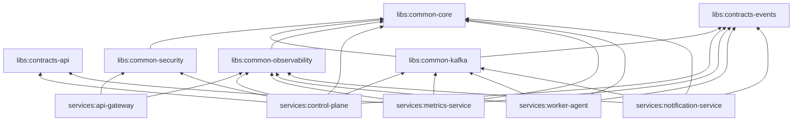

# 03 — Monorepo Structure

A single repository holds all backend services, the frontend, shared contracts, infrastructure,
and observability config. This enables **atomic cross-service changes** (e.g., evolve a Kafka
event schema and every producer/consumer in one PR) and a single source of truth for contracts.

- **Backend:** Gradle (Kotlin DSL) multi-module build.
- **Frontend:** independent pnpm/Vite workspace under `frontend/`.
- **Contracts:** shared `libs/` modules consumed by services (event schemas, DTOs, security).

---

## 1. Top-level tree

```
distributed-load-testing/
├── README.md
├── LICENSE
├── Makefile                          # dev entrypoints: infra-up, build, test, lint
├── settings.gradle.kts               # module registry
├── build.gradle.kts                  # root build (plugins, versions)
├── gradle.properties
├── gradle/
│   └── libs.versions.toml            # Gradle version catalog (single source of dep versions)
│
├── libs/                             # shared backend libraries (published intra-repo)
│   ├── contracts-events/             # Kafka event POJOs/records + JSON schemas (Avro optional)
│   ├── contracts-api/                # shared REST DTOs + OpenAPI fragments
│   ├── common-core/                  # errors, IDs, pagination, result types, time utils
│   ├── common-security/              # OIDC resource-server config, JWT, RBAC annotations
│   ├── common-kafka/                 # producer/consumer config, serdes, DLQ, tracing headers
│   └── common-observability/         # Micrometer, OTel, structured logging setup
│
├── services/
│   ├── api-gateway/                  # Spring Cloud Gateway
│   ├── control-plane/                # management + orchestration (modular)
│   │   └── src/main/java/com/loadforge/controlplane/
│   │       ├── management/           # projects, tests, schedules, apikeys (bounded context)
│   │       ├── orchestration/        # run lifecycle, sharding, worker registry
│   │       ├── streaming/            # WS/SSE live run endpoint
│   │       ├── messaging/            # Kafka producers/consumers
│   │       └── api/                  # REST controllers
│   ├── metrics-service/              # ingestion + aggregation + query
│   │   └── src/main/java/com/loadforge/metrics/
│   │       ├── ingestion/            # raw consumer
│   │       ├── aggregation/          # windowing (Kafka Streams)
│   │       ├── persistence/          # TimescaleDB repositories
│   │       ├── query/                # time-series read API
│   │       └── streaming/            # live fan-out
│   ├── worker-agent/                 # data-plane load generator
│   │   └── src/main/java/com/loadforge/worker/
│   │       ├── registration/         # register + heartbeat
│   │       ├── execution/            # k6 script render + process supervision
│   │       ├── telemetry/            # parse k6 output -> enriched samples
│   │       └── messaging/            # job consumer, command consumer, producers
│   └── notification-service/
│
├── frontend/
│   └── web-app/                      # React + TypeScript + Vite
│       ├── src/
│       │   ├── app/                  # routing, providers, layout
│       │   ├── features/             # feature-sliced modules
│       │   │   ├── projects/
│       │   │   ├── tests/
│       │   │   ├── runs/             # run control + live dashboard
│       │   │   ├── workers/
│       │   │   └── auth/
│       │   ├── shared/               # api client, ui kit, hooks, types
│       │   │   ├── api/              # generated client from OpenAPI
│       │   │   ├── ws/               # WebSocket/SSE live client
│       │   │   └── charts/           # Recharts wrappers
│       │   └── main.tsx
│       ├── index.html
│       ├── package.json
│       ├── tsconfig.json
│       └── vite.config.ts
│
├── load-scripts/                     # k6 script templates + Handlebars/Mustache partials
│   ├── templates/
│   │   ├── http-constant-vus.js.hbs
│   │   ├── http-ramping-vus.js.hbs
│   │   └── http-arrival-rate.js.hbs
│   └── lib/                          # reusable k6 helpers (auth, checks, tags)
│
├── deploy/
│   ├── docker/
│   │   ├── docker-compose.yml        # full local stack
│   │   ├── docker-compose.infra.yml  # infra only (kafka, pg, redis, keycloak, prom, grafana)
│   │   └── images/                   # per-service Dockerfiles (or in each service)
│   ├── k8s/
│   │   ├── base/                     # Kustomize base manifests
│   │   └── overlays/
│   │       ├── local/
│   │       ├── staging/
│   │       └── prod/
│   └── helm/
│       └── loadforge/                # umbrella chart + subcharts per service
│
├── observability/
│   ├── prometheus/
│   │   ├── prometheus.yml
│   │   └── rules/                    # alerting & recording rules
│   ├── grafana/
│   │   ├── provisioning/             # datasources + dashboard providers
│   │   └── dashboards/               # platform + per-run JSON dashboards
│   ├── otel/
│   │   └── otel-collector-config.yml
│   └── loki/
│
├── db/
│   ├── control/                      # Flyway migrations (schema: control)
│   ├── metrics/                      # Flyway migrations (schema: metrics + timescale)
│   └── notify/                       # Flyway migrations (schema: notify)
│
├── docs/
│   ├── architecture/                 # this documentation set (01..09)
│   ├── adr/                          # architecture decision records
│   ├── api/                          # generated OpenAPI specs
│   └── diagrams/                     # exported diagram assets
│
├── tools/
│   ├── openapi-codegen/              # generate TS client + server stubs
│   ├── seed/                         # demo data seeding
│   └── loadtest-self/                # k6 scripts that load-test LoadForge itself
│
└── .github/
    └── workflows/
        ├── backend-ci.yml            # build, test, coverage, container scan
        ├── frontend-ci.yml           # lint, typecheck, test, build
        ├── contract-tests.yml        # provider/consumer contract verification
        └── release.yml               # image build + push + helm package
```

---

## 2. Gradle module graph



`settings.gradle.kts`:

```kotlin
rootProject.name = "loadforge"

include(
    "libs:contracts-events",
    "libs:contracts-api",
    "libs:common-core",
    "libs:common-security",
    "libs:common-kafka",
    "libs:common-observability",
    "services:api-gateway",
    "services:control-plane",
    "services:metrics-service",
    "services:worker-agent",
    "services:notification-service",
)
```

---

## 3. Conventions

| Concern | Convention |
|---|---|
| Java package root | `com.loadforge.<service>` |
| Layering | `api` → `domain` (aggregates/services) → `persistence`/`messaging` (adapters). Hexagonal ports & adapters. |
| DTO vs domain | Never leak JPA entities across REST; map to DTOs (MapStruct). |
| Migrations | Flyway, versioned `V<seq>__<desc>.sql` under `db/<schema>/`. |
| Config | `application.yml` + profile overlays (`local`, `docker`, `k8s`). Secrets via env/k8s. |
| Tests | Unit (JUnit 5), integration (Testcontainers: Kafka + Postgres), contract (Spring Cloud Contract / Pact). |
| Versioning | Conventional Commits + SemVer; images tagged with git SHA + semver. |
| Code style | Spotless (Palantir Java format), ESLint + Prettier (frontend). |

---

## 4. Developer workflow (Makefile targets)

```make
infra-up:        ## start kafka, postgres/timescale, redis, keycloak, prometheus, grafana
	docker compose -f deploy/docker/docker-compose.infra.yml up -d

infra-down:
	docker compose -f deploy/docker/docker-compose.infra.yml down -v

build:           ## build all backend modules
	./gradlew clean build

test:            ## run unit + integration tests
	./gradlew test integrationTest

migrate:         ## apply Flyway migrations to local db
	./gradlew flywayMigrate

gen-client:      ## regenerate TS API client from OpenAPI
	./tools/openapi-codegen/run.sh

fe-dev:
	cd frontend/web-app && pnpm dev

stack-up:        ## full local stack (infra + services + frontend) via compose
	docker compose -f deploy/docker/docker-compose.yml up --build
```
