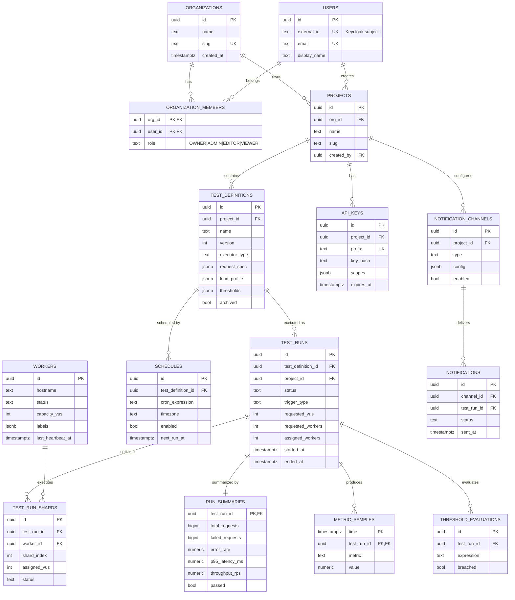

# 04 — Database Schema

PostgreSQL 16 with the **TimescaleDB** extension. Relational domain data lives in normalized
tables; high-volume metric data lives in **hypertables** with continuous aggregates and retention
policies. Each service owns its schema (`control`, `metrics`, `notify`) — no cross-service joins.

---

## 1. Entity–Relationship Diagram



---

## 2. Schema `control` — DDL

```sql
CREATE SCHEMA IF NOT EXISTS control;
SET search_path TO control;

-- ---------- Tenancy & identity ----------
CREATE TABLE organizations (
    id          UUID PRIMARY KEY DEFAULT gen_random_uuid(),
    name        TEXT NOT NULL,
    slug        TEXT NOT NULL UNIQUE,
    created_at  TIMESTAMPTZ NOT NULL DEFAULT now(),
    updated_at  TIMESTAMPTZ NOT NULL DEFAULT now()
);

CREATE TABLE users (
    id            UUID PRIMARY KEY DEFAULT gen_random_uuid(),
    external_id   TEXT NOT NULL UNIQUE,            -- Keycloak subject (sub)
    email         TEXT NOT NULL UNIQUE,
    display_name  TEXT NOT NULL,
    created_at    TIMESTAMPTZ NOT NULL DEFAULT now(),
    updated_at    TIMESTAMPTZ NOT NULL DEFAULT now()
);

CREATE TYPE org_role AS ENUM ('OWNER', 'ADMIN', 'EDITOR', 'VIEWER');

CREATE TABLE organization_members (
    org_id   UUID NOT NULL REFERENCES organizations(id) ON DELETE CASCADE,
    user_id  UUID NOT NULL REFERENCES users(id) ON DELETE CASCADE,
    role     org_role NOT NULL DEFAULT 'VIEWER',
    added_at TIMESTAMPTZ NOT NULL DEFAULT now(),
    PRIMARY KEY (org_id, user_id)
);

-- ---------- Projects ----------
CREATE TABLE projects (
    id          UUID PRIMARY KEY DEFAULT gen_random_uuid(),
    org_id      UUID NOT NULL REFERENCES organizations(id) ON DELETE CASCADE,
    name        TEXT NOT NULL,
    slug        TEXT NOT NULL,
    description TEXT,
    created_by  UUID NOT NULL REFERENCES users(id),
    created_at  TIMESTAMPTZ NOT NULL DEFAULT now(),
    updated_at  TIMESTAMPTZ NOT NULL DEFAULT now(),
    UNIQUE (org_id, slug)
);
CREATE INDEX idx_projects_org ON projects(org_id);

-- ---------- Test definitions (versioned) ----------
CREATE TABLE test_definitions (
    id            UUID PRIMARY KEY DEFAULT gen_random_uuid(),
    project_id    UUID NOT NULL REFERENCES projects(id) ON DELETE CASCADE,
    name          TEXT NOT NULL,
    description   TEXT,
    version       INT  NOT NULL DEFAULT 1,
    executor_type TEXT NOT NULL,                    -- CONSTANT_VUS | RAMPING_VUS | CONSTANT_ARRIVAL_RATE | RAMPING_ARRIVAL_RATE
    request_spec  JSONB NOT NULL,                   -- { method, url, headers, body, protocol, timeoutMs }
    load_profile  JSONB NOT NULL,                   -- { stages:[{durationSec,target}], startVus, maxVus, gracefulStopSec }
    thresholds    JSONB NOT NULL DEFAULT '[]'::jsonb, -- [ "http_req_duration:p(95)<500", "http_req_failed:rate<0.01" ]
    archived      BOOLEAN NOT NULL DEFAULT false,
    created_by    UUID NOT NULL REFERENCES users(id),
    created_at    TIMESTAMPTZ NOT NULL DEFAULT now(),
    updated_at    TIMESTAMPTZ NOT NULL DEFAULT now()
);
CREATE INDEX idx_testdef_project ON test_definitions(project_id) WHERE archived = false;

-- ---------- Workers (registry) ----------
CREATE TYPE worker_status AS ENUM ('REGISTERING','IDLE','BUSY','DRAINING','OFFLINE');

CREATE TABLE workers (
    id                UUID PRIMARY KEY DEFAULT gen_random_uuid(),
    hostname          TEXT NOT NULL,
    ip_address        INET,
    status            worker_status NOT NULL DEFAULT 'REGISTERING',
    capacity_vus      INT  NOT NULL DEFAULT 0,
    current_run_id    UUID,
    labels            JSONB NOT NULL DEFAULT '{}'::jsonb,  -- { region, instanceType, zone }
    agent_version     TEXT,
    registered_at     TIMESTAMPTZ NOT NULL DEFAULT now(),
    last_heartbeat_at TIMESTAMPTZ NOT NULL DEFAULT now()
);
CREATE INDEX idx_workers_status ON workers(status);
CREATE INDEX idx_workers_heartbeat ON workers(last_heartbeat_at);

-- ---------- Test runs ----------
CREATE TYPE run_status AS ENUM
    ('PENDING','QUEUED','PROVISIONING','RUNNING','ABORTING','COMPLETED','FAILED','ABORTED');
CREATE TYPE trigger_type AS ENUM ('MANUAL','SCHEDULED','CI');

CREATE TABLE test_runs (
    id                 UUID PRIMARY KEY DEFAULT gen_random_uuid(),
    test_definition_id UUID NOT NULL REFERENCES test_definitions(id),
    project_id         UUID NOT NULL REFERENCES projects(id),
    definition_snapshot JSONB NOT NULL,             -- immutable copy of the def at launch time
    status             run_status NOT NULL DEFAULT 'PENDING',
    trigger_type       trigger_type NOT NULL DEFAULT 'MANUAL',
    requested_vus      INT NOT NULL,
    requested_workers  INT NOT NULL,
    assigned_workers   INT NOT NULL DEFAULT 0,
    started_at         TIMESTAMPTZ,
    ended_at           TIMESTAMPTZ,
    duration_seconds   INT,
    error_message      TEXT,
    created_by         UUID REFERENCES users(id),
    version            INT NOT NULL DEFAULT 0,       -- optimistic lock
    created_at         TIMESTAMPTZ NOT NULL DEFAULT now(),
    updated_at         TIMESTAMPTZ NOT NULL DEFAULT now()
);
CREATE INDEX idx_runs_def ON test_runs(test_definition_id);
CREATE INDEX idx_runs_project_status ON test_runs(project_id, status);
CREATE INDEX idx_runs_active ON test_runs(status) WHERE status IN ('RUNNING','PROVISIONING','ABORTING');

-- ---------- Run shards (per-worker assignment) ----------
CREATE TYPE shard_status AS ENUM ('ASSIGNED','STARTING','RUNNING','COMPLETED','FAILED','LOST','ABORTED');

CREATE TABLE test_run_shards (
    id            UUID PRIMARY KEY DEFAULT gen_random_uuid(),
    test_run_id   UUID NOT NULL REFERENCES test_runs(id) ON DELETE CASCADE,
    worker_id     UUID NOT NULL REFERENCES workers(id),
    shard_index   INT  NOT NULL,
    assigned_vus  INT  NOT NULL,
    status        shard_status NOT NULL DEFAULT 'ASSIGNED',
    k6_script_ref TEXT,                              -- object-store key or inline hash
    started_at    TIMESTAMPTZ,
    ended_at      TIMESTAMPTZ,
    error_message TEXT,
    UNIQUE (test_run_id, shard_index)
);
CREATE INDEX idx_shards_run ON test_run_shards(test_run_id);
CREATE INDEX idx_shards_worker ON test_run_shards(worker_id);

-- ---------- Schedules ----------
CREATE TABLE schedules (
    id                 UUID PRIMARY KEY DEFAULT gen_random_uuid(),
    test_definition_id UUID NOT NULL REFERENCES test_definitions(id) ON DELETE CASCADE,
    cron_expression    TEXT NOT NULL,
    timezone           TEXT NOT NULL DEFAULT 'UTC',
    enabled            BOOLEAN NOT NULL DEFAULT true,
    next_run_at        TIMESTAMPTZ,
    last_run_at        TIMESTAMPTZ,
    created_at         TIMESTAMPTZ NOT NULL DEFAULT now()
);
CREATE INDEX idx_schedules_next ON schedules(next_run_at) WHERE enabled = true;

-- ---------- API keys (CI triggers) ----------
CREATE TABLE api_keys (
    id           UUID PRIMARY KEY DEFAULT gen_random_uuid(),
    project_id   UUID NOT NULL REFERENCES projects(id) ON DELETE CASCADE,
    name         TEXT NOT NULL,
    prefix       TEXT NOT NULL UNIQUE,               -- lf_live_xxxx (shown once)
    key_hash     TEXT NOT NULL,                      -- Argon2/BCrypt hash of full key
    scopes       JSONB NOT NULL DEFAULT '["run:trigger"]'::jsonb,
    last_used_at TIMESTAMPTZ,
    expires_at   TIMESTAMPTZ,
    revoked      BOOLEAN NOT NULL DEFAULT false,
    created_at   TIMESTAMPTZ NOT NULL DEFAULT now()
);

-- ---------- Audit log ----------
CREATE TABLE audit_log (
    id            BIGSERIAL PRIMARY KEY,
    org_id        UUID,
    user_id       UUID,
    action        TEXT NOT NULL,                     -- test.create, run.start, run.abort, ...
    resource_type TEXT NOT NULL,
    resource_id   UUID,
    metadata      JSONB NOT NULL DEFAULT '{}'::jsonb,
    ip_address    INET,
    created_at    TIMESTAMPTZ NOT NULL DEFAULT now()
);
CREATE INDEX idx_audit_org_time ON audit_log(org_id, created_at DESC);
```

---

## 3. Schema `metrics` — DDL (TimescaleDB)

```sql
CREATE SCHEMA IF NOT EXISTS metrics;
SET search_path TO metrics;
CREATE EXTENSION IF NOT EXISTS timescaledb;

-- ---------- Run-level aggregated samples (1s resolution) ----------
-- One row per (run, metric, second) after aggregation across all workers.
CREATE TABLE metric_samples (
    time         TIMESTAMPTZ  NOT NULL,
    test_run_id  UUID         NOT NULL,
    metric       TEXT         NOT NULL,   -- http_req_duration | http_reqs | http_req_failed | vus | data_received | iterations
    count        BIGINT       NOT NULL DEFAULT 0,
    sum          DOUBLE PRECISION,
    min          DOUBLE PRECISION,
    max          DOUBLE PRECISION,
    avg          DOUBLE PRECISION,
    p50          DOUBLE PRECISION,
    p90          DOUBLE PRECISION,
    p95          DOUBLE PRECISION,
    p99          DOUBLE PRECISION,
    PRIMARY KEY (test_run_id, metric, time)
);
SELECT create_hypertable('metrics.metric_samples', 'time', chunk_time_interval => INTERVAL '1 day');
CREATE INDEX idx_ms_run_metric_time ON metric_samples(test_run_id, metric, time DESC);

-- ---------- Per-worker samples (for worker breakdown / fairness debugging) ----------
CREATE TABLE metric_worker_samples (
    time         TIMESTAMPTZ NOT NULL,
    test_run_id  UUID        NOT NULL,
    worker_id    UUID        NOT NULL,
    metric       TEXT        NOT NULL,
    count        BIGINT      NOT NULL DEFAULT 0,
    sum          DOUBLE PRECISION,
    p95          DOUBLE PRECISION,
    PRIMARY KEY (test_run_id, worker_id, metric, time)
);
SELECT create_hypertable('metrics.metric_worker_samples', 'time', chunk_time_interval => INTERVAL '1 day');

-- ---------- Continuous aggregate: 10s rollup for zoomed-out charts ----------
CREATE MATERIALIZED VIEW metric_samples_10s
WITH (timescaledb.continuous) AS
SELECT
    time_bucket('10 seconds', time) AS bucket,
    test_run_id,
    metric,
    sum(count)                      AS count,
    avg(avg)                        AS avg,
    max(max)                        AS max,
    approx_percentile(0.95, percentile_agg(p95)) AS p95   -- illustrative; use tdigest agg in practice
FROM metric_samples
GROUP BY bucket, test_run_id, metric
WITH NO DATA;

SELECT add_continuous_aggregate_policy('metric_samples_10s',
    start_offset => INTERVAL '1 hour',
    end_offset   => INTERVAL '10 seconds',
    schedule_interval => INTERVAL '10 seconds');

-- ---------- Retention: drop raw 1s samples after 30 days ----------
SELECT add_retention_policy('metrics.metric_samples', INTERVAL '30 days');
SELECT add_retention_policy('metrics.metric_worker_samples', INTERVAL '7 days');

-- ---------- Compression for older chunks ----------
ALTER TABLE metric_samples SET (
    timescaledb.compress,
    timescaledb.compress_segmentby = 'test_run_id, metric'
);
SELECT add_compression_policy('metrics.metric_samples', INTERVAL '2 days');

-- ---------- Final run rollups ----------
CREATE TABLE run_summaries (
    test_run_id         UUID PRIMARY KEY,
    total_requests      BIGINT NOT NULL DEFAULT 0,
    failed_requests     BIGINT NOT NULL DEFAULT 0,
    error_rate          NUMERIC(6,5) NOT NULL DEFAULT 0,
    avg_latency_ms      NUMERIC(10,3),
    p50_latency_ms      NUMERIC(10,3),
    p90_latency_ms      NUMERIC(10,3),
    p95_latency_ms      NUMERIC(10,3),
    p99_latency_ms      NUMERIC(10,3),
    max_latency_ms      NUMERIC(10,3),
    throughput_rps      NUMERIC(12,2),
    peak_vus            INT,
    data_received_bytes BIGINT,
    data_sent_bytes     BIGINT,
    passed              BOOLEAN NOT NULL DEFAULT false,
    computed_at         TIMESTAMPTZ NOT NULL DEFAULT now()
);

-- ---------- Threshold evaluations ----------
CREATE TABLE threshold_evaluations (
    id           UUID PRIMARY KEY DEFAULT gen_random_uuid(),
    test_run_id  UUID NOT NULL,
    expression   TEXT NOT NULL,          -- "http_req_duration:p(95)<500"
    actual_value DOUBLE PRECISION,
    breached     BOOLEAN NOT NULL,
    evaluated_at TIMESTAMPTZ NOT NULL DEFAULT now()
);
CREATE INDEX idx_threshold_run ON threshold_evaluations(test_run_id);
```

---

## 4. Schema `notify` — DDL

```sql
CREATE SCHEMA IF NOT EXISTS notify;
SET search_path TO notify;

CREATE TYPE channel_type AS ENUM ('EMAIL','SLACK','WEBHOOK');

CREATE TABLE notification_channels (
    id         UUID PRIMARY KEY DEFAULT gen_random_uuid(),
    project_id UUID NOT NULL,
    type       channel_type NOT NULL,
    name       TEXT NOT NULL,
    config     JSONB NOT NULL,           -- { url } | { webhookUrl } | { recipients:[...] }
    enabled    BOOLEAN NOT NULL DEFAULT true,
    created_at TIMESTAMPTZ NOT NULL DEFAULT now()
);
CREATE INDEX idx_channels_project ON notification_channels(project_id);

CREATE TYPE delivery_status AS ENUM ('PENDING','SENT','FAILED','RETRYING');

CREATE TABLE notifications (
    id          UUID PRIMARY KEY DEFAULT gen_random_uuid(),
    channel_id  UUID NOT NULL REFERENCES notification_channels(id) ON DELETE CASCADE,
    test_run_id UUID NOT NULL,
    event       TEXT NOT NULL,           -- RUN_COMPLETED | RUN_FAILED | THRESHOLD_BREACHED
    payload     JSONB NOT NULL,
    status      delivery_status NOT NULL DEFAULT 'PENDING',
    attempts    INT NOT NULL DEFAULT 0,
    sent_at     TIMESTAMPTZ,
    created_at  TIMESTAMPTZ NOT NULL DEFAULT now(),
    UNIQUE (channel_id, test_run_id, event)   -- idempotent delivery
);
CREATE INDEX idx_notifications_status ON notifications(status);
```

---

## 5. Design notes

- **`definition_snapshot` on `test_runs`** — runs are immutable historical facts; we snapshot the
  definition at launch so later edits to the test don't rewrite history.
- **Optimistic locking (`version`)** on `test_runs` prevents concurrent orchestrators from double-transitioning state; combined with a Redis lock per `runId`.
- **Hypertables** partition metric data by time (daily chunks) → fast range scans, cheap retention/compression.
- **Continuous aggregates** pre-compute 10s/1m rollups so zoomed-out charts never scan raw data.
- **Wide aggregated rows** (percentiles precomputed per second) keep the read path a simple time-range scan — no percentile computation at query time for live dashboards.
- **`gen_random_uuid()`** requires `pgcrypto`/PG13+ (built-in on PG16).
