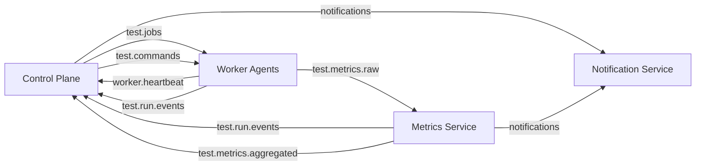
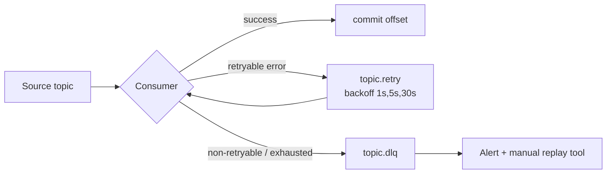

# 05 — Kafka Topics

Kafka is the asynchronous spine connecting the control plane, worker fleet, metrics pipeline, and
notifications. This document is the **topic catalog**: naming, partitioning, keys, retention,
schemas, and error-handling strategy.

---

## 1. Naming convention

```
<domain>.<entity>.<event|command>[.<qualifier>]
```

- **Events** = facts in the past tense (`test.run.events`, `worker.heartbeat`).
- **Commands** = imperative intent (`test.commands`).
- **DLQ / retry** = `<topic>.retry` and `<topic>.dlq`.

Cluster: 3 brokers (prod). Default replication factor **3**, `min.insync.replicas=2`, producers `acks=all`.

---

## 2. Topic catalog

| Topic | Purpose | Key | Partitions | Retention | Cleanup | Producer | Consumers |
|---|---|---|---|---|---|---|---|
| `test.jobs` | Job-shard assignments to workers | `runId` | 24 | 6h | delete | Control Plane | Worker Agents (group `workers`) |
| `test.commands` | Run control (STOP/ABORT/PAUSE) | `runId` | 24 | 1h | delete | Control Plane | Worker Agents (broadcast) |
| `worker.heartbeat` | Worker health & capacity | `workerId` | 12 | 10m | delete | Worker Agent | Control Plane |
| `test.run.events` | Run & shard lifecycle facts | `runId` | 12 | 7d | delete | Worker Agent, Control Plane | Control Plane, Metrics Service |
| `test.metrics.raw` | Raw enriched metric batches | `runId` | 48 | 6h | delete | Worker Agent | Metrics Service (group `metrics-agg`) |
| `test.metrics.aggregated` | 1s windowed aggregates | `runId` | 24 | 24h | delete | Metrics Service | Control Plane (live state) |
| `notifications` | Notification requests | `runId` | 6 | 3d | delete | Control Plane, Metrics Service | Notification Service |
| `*.retry` | Delayed retry (per consumer) | orig key | = source | 1d | delete | Consumers | Same consumer group |
| `*.dlq` | Poison messages | orig key | = source | 14d | delete | Consumers | Ops / manual replay |

**Partition sizing rationale**
- `test.metrics.raw` gets the most partitions (48): it's the hottest topic and its partition count
  is the parallelism ceiling for the Metrics Service.
- `test.jobs`/`test.commands` keyed by `runId` so all shards of a run land in order relative to each other; workers in the `workers` group balance partitions among themselves.
- `worker.heartbeat` keyed by `workerId` for per-worker ordering.

---

## 3. Data flow



---

## 4. Event schemas

All events share an **envelope** (headers + body). Headers carry tracing and routing metadata;
bodies are versioned JSON (Avro/Schema Registry recommended for prod — schemas below double as Avro).

### 4.1 Common envelope (Kafka headers)

| Header | Example | Purpose |
|---|---|---|
| `eventId` | `uuid` | Idempotency key |
| `eventType` | `JobAssigned` | Routing / deserialization |
| `schemaVersion` | `1` | Evolution |
| `occurredAt` | ISO-8601 | Event time |
| `traceparent` | W3C trace context | Distributed tracing |
| `correlationId` | `runId` | Cross-service correlation |

### 4.2 `test.jobs` → `JobAssigned`

```json
{
  "eventType": "JobAssigned",
  "schemaVersion": 1,
  "runId": "b3f1c2e0-...",
  "shardIndex": 2,
  "workerGroup": "workers",
  "assignedVus": 250,
  "executorType": "RAMPING_VUS",
  "loadProfile": {
    "startVus": 0,
    "stages": [
      { "durationSec": 30, "target": 250 },
      { "durationSec": 120, "target": 250 },
      { "durationSec": 30, "target": 0 }
    ],
    "gracefulStopSec": 30
  },
  "requestSpec": {
    "method": "GET",
    "url": "https://api.example.com/health",
    "headers": { "Authorization": "Bearer ***" },
    "body": null,
    "timeoutMs": 10000
  },
  "thresholds": ["http_req_duration:p(95)<500", "http_req_failed:rate<0.01"],
  "startAtEpochMs": 1730900000000
}
```

> `startAtEpochMs` gives all shards a synchronized start time for coordinated ramp-up.

### 4.3 `test.commands` → `RunCommand`

```json
{ "eventType": "RunCommand", "runId": "b3f1c2e0-...", "command": "ABORT", "reason": "user_requested" }
```
`command ∈ { STOP, ABORT, PAUSE, RESUME }`.

### 4.4 `worker.heartbeat` → `WorkerHeartbeat`

```json
{
  "eventType": "WorkerHeartbeat",
  "workerId": "9a2c-...",
  "hostname": "worker-7c9f",
  "status": "BUSY",
  "capacityVus": 500,
  "currentRunId": "b3f1c2e0-...",
  "labels": { "region": "us-east-1", "zone": "a" },
  "cpuPercent": 63.2,
  "memPercent": 41.0,
  "agentVersion": "1.4.0",
  "emittedAt": "2026-07-06T10:11:12Z"
}
```

### 4.5 `test.run.events` → `ShardLifecycle`

```json
{
  "eventType": "ShardLifecycle",
  "runId": "b3f1c2e0-...",
  "shardIndex": 2,
  "workerId": "9a2c-...",
  "phase": "COMPLETED",
  "startedAt": "2026-07-06T10:11:00Z",
  "endedAt": "2026-07-06T10:14:10Z",
  "iterations": 184320,
  "error": null
}
```
`phase ∈ { STARTING, RUNNING, COMPLETED, FAILED, ABORTED }`.

### 4.6 `test.metrics.raw` → `MetricSampleBatch`

Batched (e.g., 1s of samples) to amortize overhead:

```json
{
  "eventType": "MetricSampleBatch",
  "runId": "b3f1c2e0-...",
  "workerId": "9a2c-...",
  "shardIndex": 2,
  "windowStart": "2026-07-06T10:11:05Z",
  "windowSec": 1,
  "seq": 5,
  "samples": [
    { "metric": "http_reqs",         "count": 1920 },
    { "metric": "http_req_failed",   "count": 8 },
    { "metric": "vus",               "value": 250 },
    { "metric": "http_req_duration", "count": 1920, "sum": 172800,
      "min": 41, "max": 612, "avg": 90, "p50": 84, "p90": 140, "p95": 180, "p99": 320 },
    { "metric": "data_received",     "count": 1920, "sum": 5898240 }
  ]
}
```

> The **worker pre-aggregates per second** (histograms/t-digests) before publishing, drastically
> reducing raw event volume vs. shipping every request sample. `seq` enables gap detection.

### 4.7 `test.metrics.aggregated` → `MetricsAggregated`

Metrics Service merges all workers' batches for a window into a single run-level aggregate:

```json
{
  "eventType": "MetricsAggregated",
  "runId": "b3f1c2e0-...",
  "windowStart": "2026-07-06T10:11:05Z",
  "windowSec": 1,
  "activeVus": 500,
  "requests": 3840,
  "failures": 15,
  "errorRate": 0.0039,
  "throughputRps": 3840,
  "latencyMs": { "avg": 91, "p50": 85, "p90": 142, "p95": 181, "p99": 330, "max": 640 },
  "dataReceivedBytes": 11796480
}
```

### 4.8 `notifications` → `NotificationRequested`

```json
{
  "eventType": "NotificationRequested",
  "runId": "b3f1c2e0-...",
  "projectId": "77aa-...",
  "event": "THRESHOLD_BREACHED",
  "summary": "p95 latency 640ms exceeded threshold 500ms",
  "severity": "WARNING",
  "context": { "expression": "http_req_duration:p(95)<500", "actual": 640 }
}
```

---

## 5. Consumer semantics & ordering

| Consumer | Group | Delivery | Ordering guarantee |
|---|---|---|---|
| Worker Agent (jobs) | `workers` | at-least-once | per-partition (per `runId`) |
| Metrics Service (raw) | `metrics-agg` | at-least-once → idempotent upsert | per `runId` window via `(runId, window, seq)` |
| Control Plane (heartbeat) | `cp-heartbeat` | at-least-once | per `workerId` |
| Control Plane (events) | `cp-events` | at-least-once | per `runId` |
| Notification Service | `notify` | at-least-once → dedup by unique key | n/a |

**Idempotency:** metric writes are `INSERT ... ON CONFLICT (test_run_id, metric, time) DO UPDATE`,
so re-delivery is harmless. Notifications dedup via the `UNIQUE (channel_id, test_run_id, event)` constraint.

---

## 6. Error handling — retry & DLQ



- **Retryable** (transient DB, network): non-blocking retry topic with exponential backoff (Spring Kafka `@RetryableTopic`).
- **Non-retryable** (deserialization, schema violation): straight to `.dlq`.
- **DLQ monitoring:** Prometheus alert on `kafka_dlq_records_total > 0`; a `tools/` replay utility re-publishes after fixes.

---

## 7. Topic provisioning (IaC)

Topics are declared as code (Terraform Kafka provider or a `topics.yaml` applied by an init job), never auto-created in prod:

```yaml
# deploy/kafka/topics.yaml
- name: test.metrics.raw
  partitions: 48
  replicationFactor: 3
  config:
    retention.ms: 21600000        # 6h
    min.insync.replicas: 2
    cleanup.policy: delete
- name: test.jobs
  partitions: 24
  replicationFactor: 3
  config: { retention.ms: 21600000, min.insync.replicas: 2 }
- name: worker.heartbeat
  partitions: 12
  replicationFactor: 3
  config: { retention.ms: 600000 }
```
