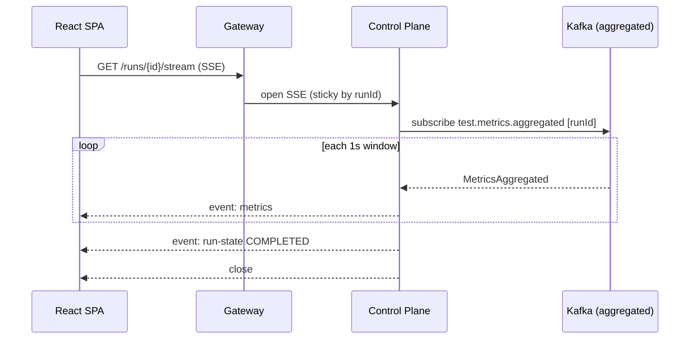

# 06 — REST API Specification

Versioned under `/api/v1`. JSON over HTTPS. Auth via **OIDC bearer JWT** (users) or **API key**
(CI: `Authorization: Bearer lf_live_...`). All list endpoints are cursor-paginated. All mutations
require the caller's project role to satisfy the endpoint's minimum role.

Base URL (through gateway): `https://api.loadforge.dev/api/v1`

---

## 1. Conventions

| Concern | Standard |
|---|---|
| Media type | `application/json; charset=utf-8` |
| Auth | `Authorization: Bearer <jwt \| api-key>` |
| Pagination | `?limit=50&cursor=<opaque>` → `{ items, nextCursor }` |
| Filtering | Explicit query params (`?status=RUNNING`) |
| Idempotency | `Idempotency-Key` header on POST that trigger side effects (run start) |
| Errors | RFC 9457 Problem Details (`application/problem+json`) |
| Correlation | `X-Request-Id` echoed; `traceparent` propagated |
| Rate limit | `X-RateLimit-Limit/Remaining/Reset` headers |
| Time | ISO-8601 UTC everywhere |

### Error shape (RFC 9457)

```json
{
  "type": "https://loadforge.dev/errors/validation",
  "title": "Validation failed",
  "status": 422,
  "detail": "requestedVus must be between 1 and 100000",
  "instance": "/api/v1/tests/abc/run",
  "errors": [ { "field": "requestedVus", "message": "must be <= 100000" } ],
  "traceId": "0af7651916cd43dd8448eb211c80319c"
}
```

### Standard status codes

| Code | Meaning |
|---|---|
| 200 | OK |
| 201 | Created (Location header set) |
| 202 | Accepted (async work started — e.g., run launch) |
| 204 | No content |
| 400 | Malformed request |
| 401 | Missing/invalid credentials |
| 403 | Authenticated but insufficient role |
| 404 | Not found (or not visible to tenant) |
| 409 | Conflict (illegal state transition, duplicate slug) |
| 422 | Semantic validation error |
| 429 | Rate limited |
| 500/503 | Server/upstream failure |

---

## 2. Endpoint catalog

### 2.1 Projects
| Method | Path | Min role | Description |
|---|---|---|---|
| GET | `/projects` | VIEWER | List projects in caller's org |
| POST | `/projects` | ADMIN | Create project |
| GET | `/projects/{projectId}` | VIEWER | Get project |
| PATCH | `/projects/{projectId}` | EDITOR | Update project |
| DELETE | `/projects/{projectId}` | ADMIN | Delete project |

### 2.2 Test definitions
| Method | Path | Min role | Description |
|---|---|---|---|
| GET | `/projects/{projectId}/tests` | VIEWER | List tests (filter `?archived=`) |
| POST | `/projects/{projectId}/tests` | EDITOR | Create test definition |
| GET | `/tests/{testId}` | VIEWER | Get test (latest version) |
| PUT | `/tests/{testId}` | EDITOR | Update → bumps `version` |
| DELETE | `/tests/{testId}` | EDITOR | Archive test |
| POST | `/tests/{testId}/validate` | EDITOR | Dry-run validate config + render k6 script |
| POST | `/tests/{testId}/run` | EDITOR | **Launch a test run** (202) |

### 2.3 Test runs
| Method | Path | Min role | Description |
|---|---|---|---|
| GET | `/tests/{testId}/runs` | VIEWER | List runs for a test |
| GET | `/projects/{projectId}/runs` | VIEWER | List runs across project (filter `?status=`) |
| GET | `/runs/{runId}` | VIEWER | Run detail + shard states |
| POST | `/runs/{runId}/abort` | EDITOR | Abort a running test (202) |
| GET | `/runs/{runId}/summary` | VIEWER | Final rollup + threshold results |
| GET | `/runs/{runId}/metrics` | VIEWER | Time-series query |
| GET | `/runs/{runId}/shards` | VIEWER | Per-worker shard breakdown |
| GET | `/runs/{runId}/stream` | VIEWER | **Live metrics** (SSE / WebSocket) |

### 2.4 Workers
| Method | Path | Min role | Description |
|---|---|---|---|
| GET | `/workers` | VIEWER | Fleet status |
| GET | `/workers/{workerId}` | VIEWER | Worker detail |
| POST | `/workers/{workerId}/drain` | ADMIN | Cordon + drain a worker |
| POST | `/internal/workers/register` | *service* | Worker self-registration (mTLS/internal) |

### 2.5 Schedules
| Method | Path | Min role | Description |
|---|---|---|---|
| GET | `/tests/{testId}/schedules` | VIEWER | List schedules |
| POST | `/tests/{testId}/schedules` | EDITOR | Create cron schedule |
| PATCH | `/schedules/{scheduleId}` | EDITOR | Enable/disable/update |
| DELETE | `/schedules/{scheduleId}` | EDITOR | Delete |

### 2.6 API keys
| Method | Path | Min role | Description |
|---|---|---|---|
| GET | `/projects/{projectId}/api-keys` | ADMIN | List (prefixes only) |
| POST | `/projects/{projectId}/api-keys` | ADMIN | Create (full key shown once) |
| DELETE | `/api-keys/{keyId}` | ADMIN | Revoke |

### 2.7 Notification channels
| Method | Path | Min role | Description |
|---|---|---|---|
| GET | `/projects/{projectId}/channels` | VIEWER | List channels |
| POST | `/projects/{projectId}/channels` | ADMIN | Add channel |
| POST | `/channels/{channelId}/test` | ADMIN | Send test notification |
| DELETE | `/channels/{channelId}` | ADMIN | Delete |

### 2.8 Platform
| Method | Path | Description |
|---|---|---|
| GET | `/actuator/health` | Liveness/readiness |
| GET | `/actuator/prometheus` | Metrics scrape |

---

## 3. Key payloads

### 3.1 Create test definition — `POST /projects/{projectId}/tests`

Request:
```json
{
  "name": "Checkout API smoke",
  "description": "p95 < 500ms at 500 VUs",
  "executorType": "RAMPING_VUS",
  "requestSpec": {
    "method": "POST",
    "url": "https://api.example.com/checkout",
    "headers": { "Content-Type": "application/json" },
    "body": "{\"cartId\":\"{{cartId}}\"}",
    "timeoutMs": 10000
  },
  "loadProfile": {
    "startVus": 0,
    "maxVus": 500,
    "stages": [
      { "durationSec": 30, "target": 500 },
      { "durationSec": 180, "target": 500 },
      { "durationSec": 30, "target": 0 }
    ],
    "gracefulStopSec": 30
  },
  "thresholds": [
    "http_req_duration:p(95)<500",
    "http_req_failed:rate<0.01"
  ]
}
```

Response `201 Created`, `Location: /api/v1/tests/{id}`:
```json
{ "id": "e1d2...", "projectId": "77aa...", "name": "Checkout API smoke", "version": 1, "createdAt": "2026-07-06T10:00:00Z" }
```

### 3.2 Launch run — `POST /tests/{testId}/run`

Request (optional overrides):
```json
{ "requestedVus": 500, "requestedWorkers": 4, "triggerType": "MANUAL" }
```

Response `202 Accepted`, `Location: /api/v1/runs/{runId}`:
```json
{
  "runId": "b3f1c2e0...",
  "status": "PROVISIONING",
  "requestedVus": 500,
  "requestedWorkers": 4,
  "createdAt": "2026-07-06T10:11:00Z"
}
```
- `409` if fewer healthy workers than required and `requestedWorkers` cannot be satisfied by policy.

### 3.3 Time-series — `GET /runs/{runId}/metrics`

Query params: `?metric=http_req_duration&from=...&to=...&resolution=1s|10s|1m&agg=p95`

Response `200`:
```json
{
  "runId": "b3f1c2e0...",
  "metric": "http_req_duration",
  "resolution": "1s",
  "series": [
    { "t": "2026-07-06T10:11:05Z", "p50": 85, "p95": 181, "p99": 330, "avg": 91, "max": 640 },
    { "t": "2026-07-06T10:11:06Z", "p50": 88, "p95": 190, "p99": 351, "avg": 96, "max": 610 }
  ]
}
```

### 3.4 Run summary — `GET /runs/{runId}/summary`

```json
{
  "runId": "b3f1c2e0...",
  "status": "COMPLETED",
  "passed": false,
  "durationSeconds": 240,
  "totals": { "requests": 921600, "failures": 3195, "errorRate": 0.00347 },
  "latencyMs": { "avg": 94, "p50": 86, "p90": 150, "p95": 205, "p99": 410, "max": 1120 },
  "throughputRps": 3840,
  "peakVus": 500,
  "data": { "receivedBytes": 2831155200, "sentBytes": 184320000 },
  "thresholds": [
    { "expression": "http_req_duration:p(95)<500", "actual": 205, "breached": false },
    { "expression": "http_req_failed:rate<0.01", "actual": 0.00347, "breached": false }
  ]
}
```

---

## 4. Live streaming API

`GET /runs/{runId}/stream` — content negotiated:

- **SSE** (`Accept: text/event-stream`) — default, simplest for charts.
- **WebSocket** (`Upgrade: websocket`) — for bidirectional (future: live command echo).

SSE event stream:
```
event: metrics
data: {"windowStart":"2026-07-06T10:11:05Z","activeVus":500,"throughputRps":3840,"errorRate":0.0039,"latencyMs":{"p95":181}}

event: run-state
data: {"status":"RUNNING","assignedWorkers":4,"completedShards":0}

event: threshold
data: {"expression":"http_req_duration:p(95)<500","actual":520,"breached":true}
```

Server pushes at the 1s aggregation cadence. The gateway maintains sticky routing (consistent hash on `runId`) so a client stays pinned to one control-plane instance holding the live subscription.



---

## 5. OpenAPI fragment

```yaml
openapi: 3.1.0
info:
  title: LoadForge API
  version: 1.0.0
servers:
  - url: https://api.loadforge.dev/api/v1
security:
  - bearerAuth: []
paths:
  /tests/{testId}/run:
    post:
      operationId: launchRun
      summary: Launch a distributed test run
      parameters:
        - name: testId
          in: path
          required: true
          schema: { type: string, format: uuid }
        - name: Idempotency-Key
          in: header
          required: false
          schema: { type: string }
      requestBody:
        content:
          application/json:
            schema: { $ref: '#/components/schemas/LaunchRunRequest' }
      responses:
        '202':
          description: Run accepted
          headers:
            Location: { schema: { type: string } }
          content:
            application/json:
              schema: { $ref: '#/components/schemas/RunAccepted' }
        '409': { $ref: '#/components/responses/Conflict' }
        '422': { $ref: '#/components/responses/ValidationError' }
components:
  securitySchemes:
    bearerAuth: { type: http, scheme: bearer, bearerFormat: JWT }
  schemas:
    LaunchRunRequest:
      type: object
      properties:
        requestedVus:      { type: integer, minimum: 1, maximum: 100000 }
        requestedWorkers:  { type: integer, minimum: 1, maximum: 200 }
        triggerType:       { type: string, enum: [MANUAL, SCHEDULED, CI] }
    RunAccepted:
      type: object
      required: [runId, status]
      properties:
        runId:  { type: string, format: uuid }
        status: { type: string, enum: [PENDING, QUEUED, PROVISIONING] }
```

> The full spec is generated from annotated controllers (springdoc-openapi) and published to
> `docs/api/openapi.yaml`; the TS client is generated from it (see `tools/openapi-codegen`).
