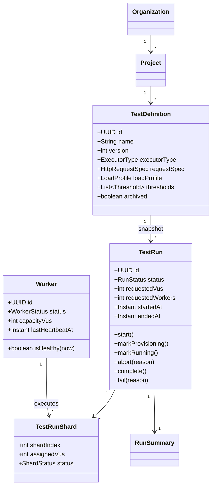

# 07 — Domain Models

Java 21. Aggregates are modeled with rich domain types; value objects are `record`s; persistence
uses JPA entities mapped to DTOs at the API boundary (never leak entities). Kafka events are
immutable `record`s in `libs:contracts-events`. Illustrative code — trimmed for signal.

---

## 1. Aggregate overview



---

## 2. Value objects (`record`s)

```java
package com.loadforge.contracts.api;

public record HttpRequestSpec(
        HttpMethod method,
        String url,
        Map<String, String> headers,
        String body,
        int timeoutMs
) {
    public HttpRequestSpec {
        Objects.requireNonNull(method, "method");
        if (url == null || url.isBlank()) throw new IllegalArgumentException("url required");
        if (timeoutMs <= 0) throw new IllegalArgumentException("timeoutMs must be > 0");
        headers = headers == null ? Map.of() : Map.copyOf(headers);
    }
}

public enum HttpMethod { GET, POST, PUT, PATCH, DELETE, HEAD, OPTIONS }

public record Stage(int durationSec, int target) {
    public Stage {
        if (durationSec <= 0) throw new IllegalArgumentException("durationSec must be > 0");
        if (target < 0) throw new IllegalArgumentException("target must be >= 0");
    }
}

public record LoadProfile(
        int startVus,
        int maxVus,
        List<Stage> stages,
        int gracefulStopSec
) {
    public LoadProfile {
        if (stages == null || stages.isEmpty())
            throw new IllegalArgumentException("at least one stage required");
        stages = List.copyOf(stages);
    }
    public int totalDurationSec() {
        return stages.stream().mapToInt(Stage::durationSec).sum();
    }
    public int peakTarget() {
        return stages.stream().mapToInt(Stage::target).max().orElse(startVus);
    }
}

/** Parsed k6-style threshold expression, e.g. "http_req_duration:p(95)<500". */
public record Threshold(String metric, String aggregation, Comparator comparator, double value) {
    public enum Comparator { LT, LTE, GT, GTE, EQ }

    public static Threshold parse(String expr) { /* regex parse -> fields */ return null; }
    public String asExpression() { return metric + ":" + aggregation + comparator.symbol() + value; }
}
```

---

## 3. Enums

```java
package com.loadforge.contracts.api;

public enum ExecutorType {
    CONSTANT_VUS,
    RAMPING_VUS,
    CONSTANT_ARRIVAL_RATE,
    RAMPING_ARRIVAL_RATE
}

public enum RunStatus {
    PENDING, QUEUED, PROVISIONING, RUNNING, ABORTING, COMPLETED, FAILED, ABORTED;

    private static final Map<RunStatus, Set<RunStatus>> ALLOWED = Map.of(
        PENDING,      EnumSet.of(QUEUED, FAILED),
        QUEUED,       EnumSet.of(PROVISIONING, FAILED, ABORTED),
        PROVISIONING, EnumSet.of(RUNNING, FAILED, ABORTING),
        RUNNING,      EnumSet.of(COMPLETED, FAILED, ABORTING),
        ABORTING,     EnumSet.of(ABORTED, FAILED)
    );

    public boolean canTransitionTo(RunStatus next) {
        return ALLOWED.getOrDefault(this, Set.of()).contains(next);
    }
    public boolean isTerminal() {
        return this == COMPLETED || this == FAILED || this == ABORTED;
    }
}

public enum ShardStatus { ASSIGNED, STARTING, RUNNING, COMPLETED, FAILED, LOST, ABORTED }

public enum WorkerStatus { REGISTERING, IDLE, BUSY, DRAINING, OFFLINE }
```

---

## 4. Aggregate root — `TestRun`

Encapsulates its state machine; illegal transitions throw. This is the heart of orchestration.

```java
package com.loadforge.controlplane.orchestration.domain;

public class TestRun {

    private final UUID id;
    private final UUID testDefinitionId;
    private final UUID projectId;
    private final JsonNode definitionSnapshot;   // immutable copy at launch
    private final int requestedVus;
    private final int requestedWorkers;

    private RunStatus status;
    private final List<TestRunShard> shards = new ArrayList<>();
    private Instant startedAt;
    private Instant endedAt;
    private String errorMessage;
    private long version;                          // optimistic lock

    public static TestRun launch(TestDefinition def, int vus, int workers, UUID actor) {
        var run = new TestRun(UUID.randomUUID(), def.id(), def.projectId(),
                              def.snapshot(), vus, workers);
        run.status = RunStatus.QUEUED;
        return run;
    }

    public void assignShards(List<TestRunShard> assigned) {
        transitionTo(RunStatus.PROVISIONING);
        shards.addAll(assigned);
    }

    public void markRunning() {
        transitionTo(RunStatus.RUNNING);
        this.startedAt = Instant.now();
    }

    public void onShardCompleted(int shardIndex) {
        shard(shardIndex).complete();
        if (shards.stream().allMatch(TestRunShard::isTerminal)) {
            boolean anyFailed = shards.stream().anyMatch(s -> s.status() == ShardStatus.FAILED);
            transitionTo(anyFailed ? RunStatus.FAILED : RunStatus.COMPLETED);
            this.endedAt = Instant.now();
        }
    }

    public void abort(String reason) {
        transitionTo(RunStatus.ABORTING);
        this.errorMessage = reason;
    }

    public void fail(String reason) {
        this.errorMessage = reason;
        transitionTo(RunStatus.FAILED);
        this.endedAt = Instant.now();
    }

    private void transitionTo(RunStatus next) {
        if (!status.canTransitionTo(next))
            throw new IllegalStateTransitionException(status, next);
        this.status = next;
    }

    private TestRunShard shard(int idx) {
        return shards.stream().filter(s -> s.shardIndex() == idx).findFirst()
                     .orElseThrow(() -> new ShardNotFoundException(id, idx));
    }
    // getters omitted
}
```

---

## 5. Sharding domain service

Pure function turning a run request + healthy worker capacities into shard assignments.

```java
package com.loadforge.controlplane.orchestration.domain;

public class VuShardingService {

    /**
     * Distributes requestedVus across the fewest healthy workers needed,
     * balancing load and respecting per-worker capacity.
     */
    public List<ShardPlan> plan(int requestedVus, int requestedWorkers, List<Worker> healthy) {
        List<Worker> usable = healthy.stream()
            .filter(w -> w.status() == WorkerStatus.IDLE)
            .sorted(Comparator.comparingInt(Worker::capacityVus).reversed())
            .limit(requestedWorkers)
            .toList();

        int totalCapacity = usable.stream().mapToInt(Worker::capacityVus).sum();
        if (usable.size() < requestedWorkers || totalCapacity < requestedVus)
            throw new InsufficientCapacityException(requestedVus, requestedWorkers, totalCapacity);

        int base = requestedVus / usable.size();
        int remainder = requestedVus % usable.size();

        List<ShardPlan> plans = new ArrayList<>();
        for (int i = 0; i < usable.size(); i++) {
            int vus = base + (i < remainder ? 1 : 0);   // spread remainder
            plans.add(new ShardPlan(i, usable.get(i).id(), vus));
        }
        return plans;
    }

    public record ShardPlan(int shardIndex, UUID workerId, int assignedVus) {}
}
```

---

## 6. JPA entity vs. DTO (boundary mapping)

```java
// Persistence adapter — never returned from controllers
@Entity @Table(schema = "control", name = "test_runs")
class TestRunEntity {
    @Id UUID id;
    @Enumerated(EnumType.STRING) RunStatus status;
    @Version long version;
    @Column(columnDefinition = "jsonb") @JdbcTypeCode(SqlTypes.JSON) JsonNode definitionSnapshot;
    // ...
}

// API DTO — the wire contract
public record TestRunView(
        UUID runId, UUID testId, RunStatus status,
        int requestedVus, int assignedWorkers,
        Instant startedAt, Instant endedAt,
        List<ShardView> shards
) {}

public record ShardView(int shardIndex, UUID workerId, ShardStatus status, int assignedVus) {}
```

---

## 7. Kafka event contracts (`libs:contracts-events`)

```java
package com.loadforge.contracts.events;

public sealed interface DomainEvent permits
        JobAssigned, RunCommand, WorkerHeartbeat, ShardLifecycle,
        MetricSampleBatch, MetricsAggregated, NotificationRequested {
    UUID eventId();
    Instant occurredAt();
    int schemaVersion();
}

public record JobAssigned(
        UUID eventId, Instant occurredAt, int schemaVersion,
        UUID runId, int shardIndex, int assignedVus,
        ExecutorType executorType, LoadProfile loadProfile,
        HttpRequestSpec requestSpec, List<String> thresholds,
        long startAtEpochMs
) implements DomainEvent {}

public record MetricSampleBatch(
        UUID eventId, Instant occurredAt, int schemaVersion,
        UUID runId, UUID workerId, int shardIndex,
        Instant windowStart, int windowSec, long seq,
        List<MetricSample> samples
) implements DomainEvent {
    public record MetricSample(
            String metric, long count, Double sum, Double min, Double max,
            Double avg, Double p50, Double p90, Double p95, Double p99, Double value
    ) {}
}

public record MetricsAggregated(
        UUID eventId, Instant occurredAt, int schemaVersion,
        UUID runId, Instant windowStart, int windowSec,
        int activeVus, long requests, long failures, double errorRate,
        double throughputRps, Latency latencyMs, long dataReceivedBytes
) implements DomainEvent {
    public record Latency(double avg, double p50, double p90, double p95, double p99, double max) {}
}

public record WorkerHeartbeat(
        UUID eventId, Instant occurredAt, int schemaVersion,
        UUID workerId, String hostname, WorkerStatus status,
        int capacityVus, UUID currentRunId, Map<String,String> labels,
        double cpuPercent, double memPercent, String agentVersion
) implements DomainEvent {}
```

> `sealed interface DomainEvent` + `record` gives exhaustive `switch` pattern matching in
> consumers (Java 21), catching unhandled event types at compile time.

```java
// Consumer dispatch with exhaustive switch
DomainEvent event = deserialize(record.value());
switch (event) {
    case ShardLifecycle s      -> orchestrator.onShardLifecycle(s);
    case WorkerHeartbeat h     -> workerRegistry.onHeartbeat(h);
    case MetricsAggregated a   -> liveState.onAggregate(a);
    default                    -> log.warn("Unhandled event {}", event.getClass());
}
```
