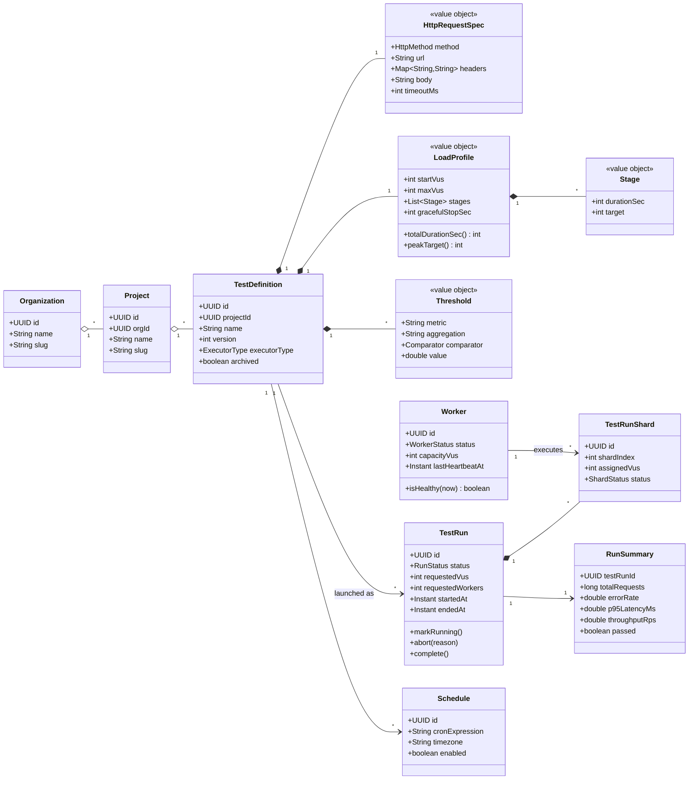
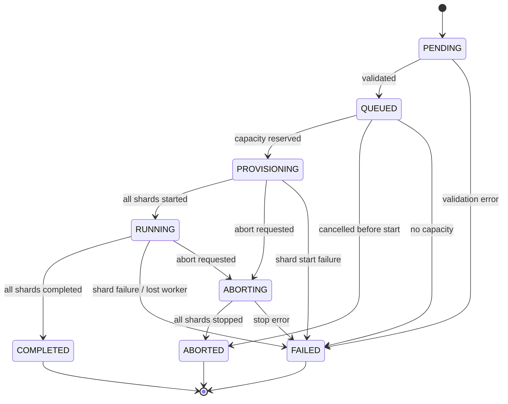
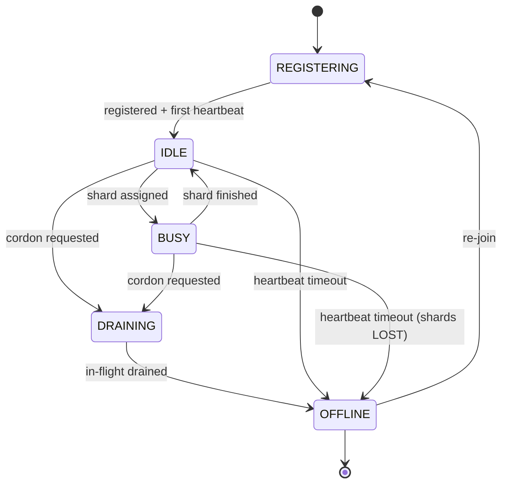
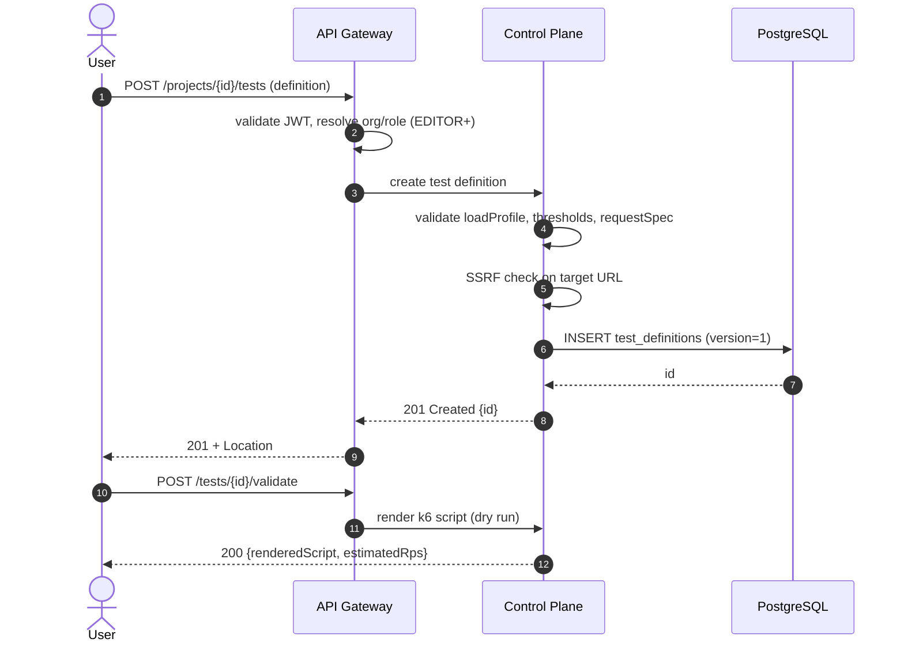
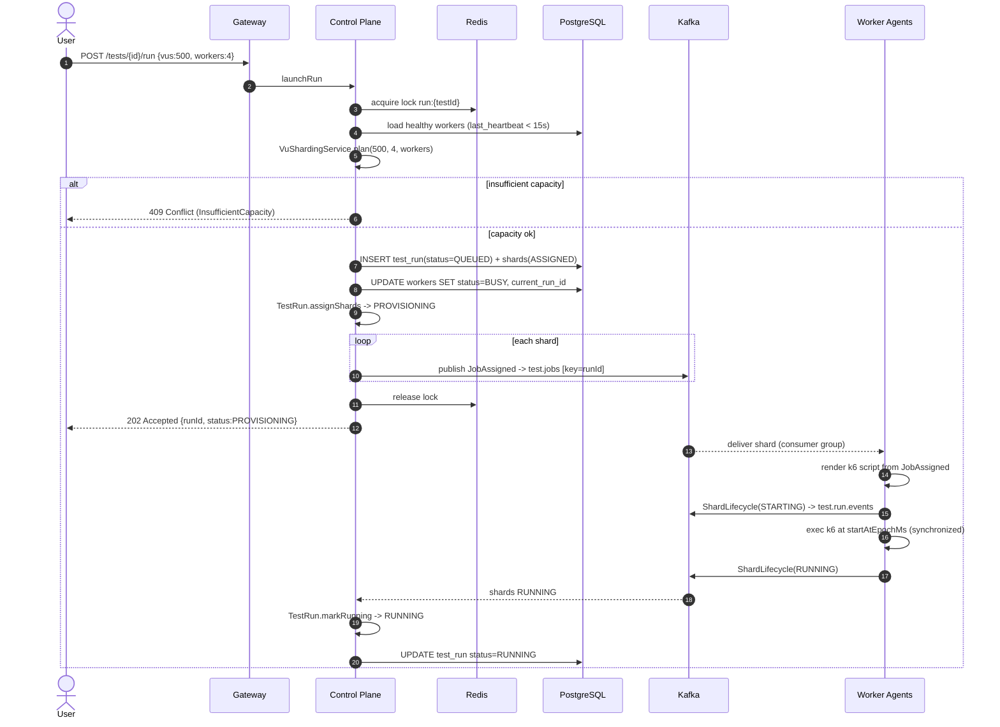
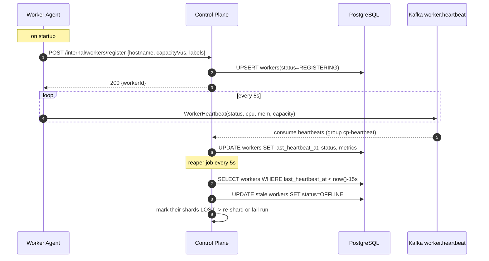
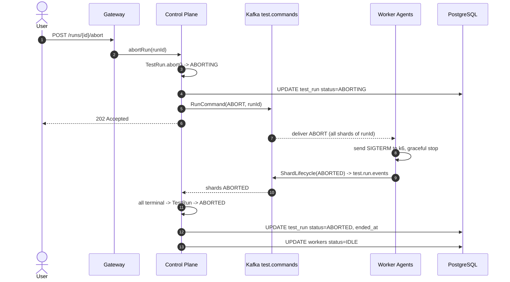
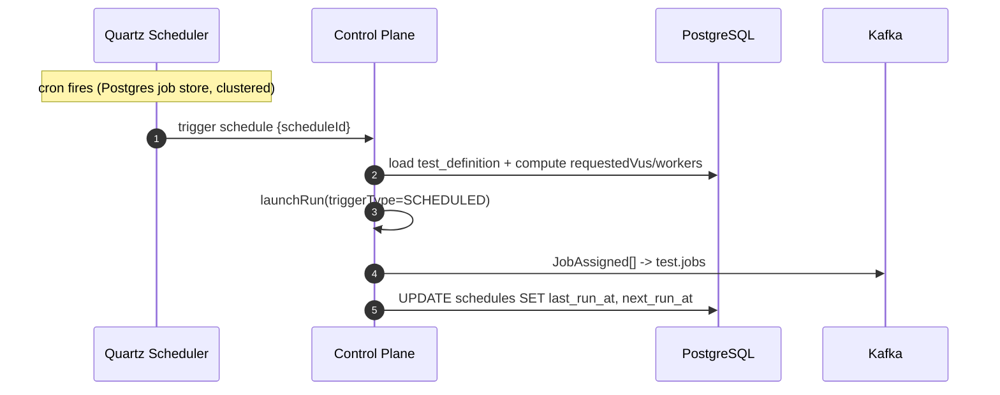
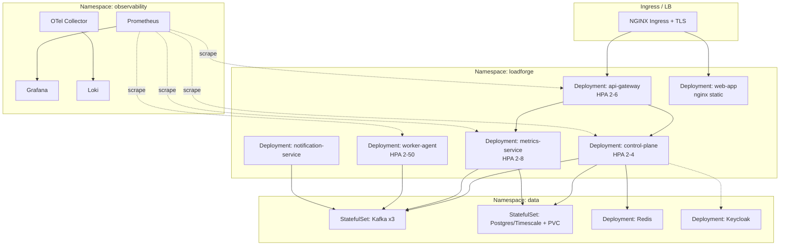

# 08 — UML & Sequence Diagrams

All diagrams are Mermaid so they render in GitHub/VS Code and stay version-controlled.

---

## 1. Domain class diagram (full)



---

## 2. TestRun state machine



## 3. Worker state machine



---

## 4. Sequence — Create & validate a test



---

## 5. Sequence — Launch distributed run (orchestration core)



---

## 6. Sequence — Metrics pipeline & live dashboard

```mermaid
sequenceDiagram
    autonumber
    participant W as Worker Agent
    participant K1 as Kafka test.metrics.raw
    participant MS as Metrics Service
    participant DB as TimescaleDB
    participant K2 as Kafka test.metrics.aggregated
    participant CP as Control Plane
    participant UI as React SPA

    Note over W: k6 emits samples; agent pre-aggregates per 1s (t-digest)
    loop every 1s window
        W->>K1: MetricSampleBatch(runId, workerId, seq)
    end
    K1-->>MS: consume batches (group metrics-agg)
    MS->>MS: merge all workers for window (tumbling 1s)
    MS->>DB: upsert metric_samples ON CONFLICT DO UPDATE
    MS->>MS: evaluate thresholds (streaming)
    MS->>K2: MetricsAggregated(window)
    alt threshold breached
        MS->>CP: NotificationRequested -> notifications
    end
    K2-->>CP: MetricsAggregated
    CP-->>UI: SSE event: metrics (live charts)
    UI->>UI: append point to Recharts series
```

---

## 7. Sequence — Worker registration & heartbeat



---

## 8. Sequence — Abort a running test



---

## 9. Sequence — Scheduled run trigger



---

## 10. Deployment view (Kubernetes)


