# 09 — Development Roadmap

An incremental, demo-able roadmap. Each phase ends in a **working vertical slice** you can show,
and each lists **exit criteria** and **resume talking points**. Build in this order — every phase
depends on the previous. Estimates are relative sizing (S/M/L), not calendar promises.

```mermaid
flowchart LR
    P0[P0 Foundation] --> P1[P1 Test Mgmt]
    P1 --> P2[P2 Orchestration]
    P2 --> P3[P3 Metrics Pipeline]
    P3 --> P4[P4 Live Dashboards]
    P4 --> P5[P5 Reliability & Scale]
    P5 --> P6[P6 Security & Multi-tenancy]
    P6 --> P7[P7 Observability & Prod]
    P7 --> P8[P8 Polish & Demo]
```

---

## Phase 0 — Foundation & walking skeleton  *(size: M)*

**Goal:** repo, build, and local infra boot with one trivial request flowing end-to-end.

- Gradle multi-module monorepo + version catalog + Spotless.
- `libs:common-core`, `common-observability`, `common-kafka` skeletons.
- `docker-compose.infra.yml`: Kafka (Redpanda), Postgres+TimescaleDB, Redis, Keycloak, Prometheus, Grafana.
- `control-plane` boots with `/actuator/health`; Flyway runs an empty baseline.
- GitHub Actions: build + test + container scan.
- **Walking skeleton:** SPA → gateway → control-plane `GET /ping` → 200.

**Exit criteria:** `make infra-up && ./gradlew build` green; CI passing; health checks up.
**Resume point:** "Cloud-native monorepo with reproducible local infra via Docker Compose and CI from day one."

---

## Phase 1 — Test management (CRUD vertical slice)  *(size: M)*

**Goal:** create/list/edit test definitions and projects through the UI.

- `control` schema: `organizations`, `users`, `projects`, `test_definitions` (Flyway).
- Management module: Project & TestDefinition aggregates, repositories, REST controllers.
- OpenAPI via springdoc; generate TS client (`tools/openapi-codegen`).
- React: project list, test editor form (request spec, load profile, thresholds), TanStack Query.
- Validation: load-profile & threshold parsing; SSRF guard on target URL.

**Exit criteria:** author a test in the UI, persisted and reloadable; OpenAPI published; integration tests (Testcontainers Postgres) green.
**Resume point:** "Hexagonal Spring Boot service with contract-first OpenAPI and a generated TypeScript client."

---

## Phase 2 — Orchestration & distributed execution  *(size: L)*  ⭐ core differentiator

**Goal:** launch a run; workers actually generate k6 load in a distributed, sharded way.

- `test_runs`, `test_run_shards`, `workers` schema + aggregates + `RunStatus` state machine.
- `VuShardingService` (unit-tested pure logic).
- Kafka topics `test.jobs`, `test.commands`, `worker.heartbeat`, `test.run.events`.
- **Worker Agent:** register/heartbeat, consume job shard, render k6 script from template, run k6 subprocess, emit shard lifecycle. Honor ABORT.
- Redis distributed lock per run; optimistic locking on `test_runs`.
- Reaper: stale-worker detection → `LOST` shards.
- UI: "Run" button, run list, shard/worker breakdown, abort.

**Exit criteria:** one click launches a run; N workers each execute their VU shard against a demo SUT; abort works; failing a worker is handled.
**Resume point:** "Event-driven orchestration that sharded virtual users across an elastic worker fleet via Kafka consumer groups, with a formal run state machine and worker failure recovery."

---

## Phase 3 — Metrics streaming pipeline  *(size: L)*  ⭐ core differentiator

**Goal:** real metrics flow from k6 → Kafka → aggregation → TimescaleDB.

- Worker: parse k6 streaming output, pre-aggregate per-second (t-digest), publish `MetricSampleBatch`.
- `metrics` schema: hypertables, continuous aggregates, retention & compression policies.
- **Metrics Service:** consume raw batches, tumbling 1s window merge across workers, idempotent upserts, publish `MetricsAggregated`.
- Streaming threshold evaluation; compute `run_summaries` on completion.
- REST: `GET /runs/{id}/metrics`, `/summary`.

**Exit criteria:** after a run, query historical latency/throughput/error-rate series and a correct pass/fail summary; re-delivery causes no double counting.
**Resume point:** "High-throughput ingestion pipeline: per-worker t-digest pre-aggregation, tumbling-window merge, idempotent TimescaleDB writes, continuous aggregates and retention/compression."

---

## Phase 4 — Live dashboards  *(size: M)*

**Goal:** sub-second live view of a running test.

- Control Plane consumes `test.metrics.aggregated`, fans out over **SSE/WebSocket** per `runId`.
- Gateway sticky routing (consistent hash on `runId`).
- React live dashboard: VUs, RPS, latency percentiles, error rate — streaming Recharts; run-state banner; threshold breach highlights.
- Grafana: provisioned per-run + platform dashboards.

**Exit criteria:** watch a run live with < 2s end-to-end lag; charts update every second; Grafana dashboards provisioned.
**Resume point:** "Real-time streaming UX (SSE) with sub-2-second end-to-end latency and sticky edge routing for stateful subscriptions."

---

## Phase 5 — Reliability & scale  *(size: L)*

**Goal:** survive failure and scale the data plane.

- DLQ + retry topics on every consumer (`@RetryableTopic`); replay tool in `tools/`.
- Backpressure: worker throttles publish on consumer lag.
- Kubernetes: Deployments, HPAs; **worker HPA on custom "pending VU demand" metric**.
- Graceful shutdown & drain for workers; PodDisruptionBudgets.
- **Self load test:** use LoadForge to load-test its own API (`tools/loadtest-self`) and document scaling limits.

**Exit criteria:** kill a worker mid-run and the run completes or fails cleanly; data plane autoscales under demand; DLQ observable and replayable.
**Resume point:** "Designed for failure: DLQ/retry with backoff, custom-metric HPA autoscaling of the load-generation fleet, and load-tested the platform with itself."

---

## Phase 6 — Security & multi-tenancy  *(size: M)*

**Goal:** production auth model.

- Keycloak realm; gateway JWT validation; services as OIDC resource servers.
- Project-scoped RBAC (`OWNER/ADMIN/EDITOR/VIEWER`) enforced via method security.
- API keys (Argon2-hashed, prefixed, scoped) for CI triggers; `Idempotency-Key` on run launch.
- Org-level row scoping on every query; audit log for sensitive actions.
- Secrets via k8s Secrets/Vault; SSRF allow-lists per org.

**Exit criteria:** unauthorized cross-tenant access is impossible; CI can trigger a run with a scoped key; audit trail present.
**Resume point:** "Multi-tenant RBAC with OIDC, hashed scoped API keys, per-tenant row isolation, idempotent mutations, and an audit trail."

---

## Phase 7 — Observability & production readiness  *(size: M)*

**Goal:** operable in production.

- OpenTelemetry tracing across gateway → services → **Kafka headers** (trace continues through async hops).
- Micrometer RED + domain metrics (active runs, worker utilization, Kafka lag, DLQ count).
- Structured JSON logging (`traceId/runId/workerId`) → Loki.
- Prometheus alert rules (DLQ > 0, consumer lag, worker starvation, error budget).
- Helm umbrella chart; Kustomize overlays (local/staging/prod); resource limits, probes, PDBs.
- Runbook + ADRs finalized.

**Exit criteria:** a single trace spans SPA → gateway → control-plane → Kafka → metrics-service; alerts fire in a chaos test; `helm install` deploys the full stack.
**Resume point:** "Full observability with distributed tracing across asynchronous Kafka boundaries, RED + domain metrics, alerting, and Helm-packaged deployment."

---

## Phase 8 — Polish & demo  *(size: S)*

**Goal:** resume-ready presentation.

- Seed/demo script (`tools/seed`) with a canned SUT + one-command demo.
- Architecture docs (this set) linked from README; exported diagrams in `docs/diagrams/`.
- Short screen-capture / GIFs of a live run in the README.
- Performance notes: peak RPS achieved, worker count, latency of the pipeline.

**Exit criteria:** a stranger can clone, `make stack-up`, run a demo test, and see live results in minutes.
**Resume point:** "End-to-end, self-hostable distributed load testing platform with a one-command demo."

---

## Priority guidance

| Priority | Phases | Why |
|---|---|---|
| **Must-have (MVP that impresses)** | P0 → P4 | The distributed orchestration + streaming metrics + live dashboard *is* the story. |
| **Strongly recommended** | P5, P7 | Reliability and observability are what separate "toy" from "senior/staff". |
| **Differentiators** | P6, self-load-test in P5 | Multi-tenancy + "I load-tested my load tester" are memorable interview hooks. |

## Definition of Done (per phase)

- Unit + integration tests (Testcontainers) green; coverage tracked.
- OpenAPI / event schemas updated; TS client regenerated.
- Flyway migrations forward-only and idempotent.
- Dashboards/alerts updated if a new metric was added.
- ADR written for any non-trivial decision.
- Docs updated in the same PR (contracts and diagrams stay truthful).

## Suggested first three PRs

1. **`chore: bootstrap monorepo`** — Gradle modules, version catalog, compose infra, CI (Phase 0).
2. **`feat: project & test definition CRUD`** — schema, aggregates, REST, OpenAPI, UI form (Phase 1).
3. **`feat: run orchestration & worker agent`** — sharding, Kafka jobs, k6 execution, abort (Phase 2).
